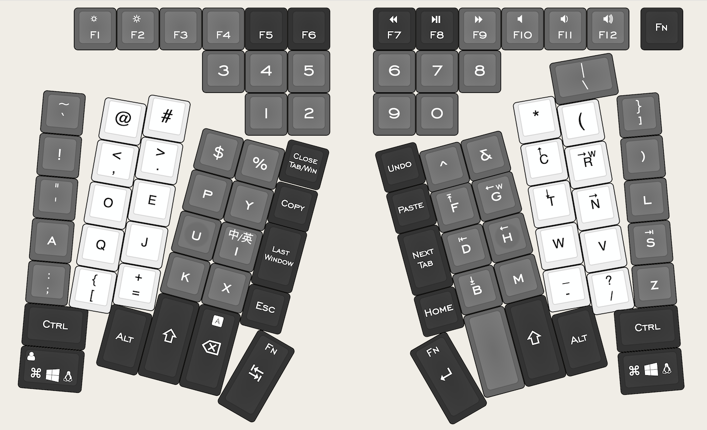

# dumang-free
Configuration data for [Dumang Free keyboard](https://www.admacro.xyz/kbd/dumang_dk6.html) layout.

## Dumang Free Layout 20201023

Bigger and more details [here](http://www.keyboard-layout-editor.com/#/gists/04304dff960cfb969da6850280b3853c).

### Features:
 - Split
 - Straight angled key columns (15 degree)
 - Thumb keys and index-finger keys
 - Macro keys (copy, paste, delete tab/window(`cmd`+`w`), last window)
 - Dvorak layout
 - Emacs [xah-fly-key](http://ergoemacs.org/misc/ergoemacs_vi_mode.html) user friendly (Easy to reach `Home` and `Esc`)
 - Dedicated symbol and number keys (`!@#$%^&*()`)
 - Minimum strain on pinky (except `Shift` and `` `~ `` keys)
 - Multi-layer support (e.g. `fn`+`e/j/o/u` => arrow keys, and function keys => multimedia keys)

### Update 20201024:
 - Swapped `Cmd` and `Backspace`
 - Renamed `Delete Tab` key to `Delete Tab/Win` and moved it to up left corner to avoid closing window or tab accidentally
 - Bigger `Fn` keycap for easier pressing and comfort (I press this key with edge of my palm)

### Update 20201030:
 - Renamed `Delete Tab/Win` to `Close Tab/Win` and moved it to an index-finger position
 - Swapped `Left-Shift` and `/?`, and `Right-Shift` and `=+`
 - Replaced `Right-Ctrl` with `Fn`
 - Added one more and moved `Cmd` to palm postion on both sides
 - `Shift`, `Tab`, `Esc` and `Home` are now all thumb keys
 - Added two more macro keys: `Undo` and `Next Tab` (`Ctrl`+`Tab`)
 - Moved `Caps Lock` to `Fn` layer of `Backspace` key
 - Labeled `Fn` layer of `i` `d` `h` `t` `n` `s` `f` `g` `c` `r` `b` (simulating xah-fly-key navigation keys)

### Update 20201107:
 - New key color, legend color to match actual keycaps (dolch), and adjusted legend size
 - Added keycap info: middle finger and ring finger columns are Cherry profile (low profile) and the rest are SA profile (high profile)
 - Adjusted rotation of middle, ring and pinky columns for better ergonomics (5 degree difference)
 - Changed layout of `=+`, `/?`, `}]`, `\|` and `` `~ `` for better ergnomics
   - `/?`: moved to right hand for muscle memory retainment
   - `}]`: moved to top right as it's auto completed mostly
   - `\|`: moved to top right for easy pressing by ring finger (not pinky)
   - `` `~ ``: moved to top left for easy pressing by ring finger (not pinky)
 - Moved `Fn` key to top right corner to avoid accidental press by right palm
